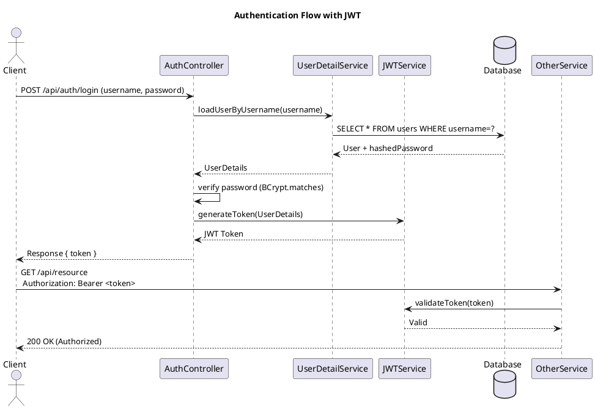

# 🛡️ AuthService - Dịch vụ xác thực và phân quyền (Spring Security + JWT + BCrypt)

## 📖 Giới thiệu
**AuthService** là microservice phụ trách **xác thực người dùng**, **cấp JWT Token**, và **phân quyền truy cập** cho toàn hệ thống.  
Dự án được xây dựng bằng **Spring Boot** với các công nghệ bảo mật hiện đại như:
- **Spring Security** để kiểm soát truy cập.
- **JWT (JSON Web Token)** để xác thực stateless giữa client và server.
- **BCrypt** để mã hóa mật khẩu an toàn trong cơ sở dữ liệu.
- **Role-based Authorization** để giới hạn quyền theo vai trò người dùng (`ROLE_ADMIN`, `ROLE_USER`, ...).


## 🧩 Kiến trúc tổng quan


Client (React, Angular, v.v.)
|

[ API Gateway (8080) ]
|

[ AuthService (8081) ]
|

[ Database (SQL Server, MySql, v.v.) ]


- **AuthService** đảm nhận việc đăng ký, đăng nhập và xác thực JWT.  
- **Các microservice khác** (ví dụ: SponsorService, ContractService) sẽ **gọi đến AuthService** để xác minh token hoặc lấy thông tin người dùng.


## ⚙️ Công nghệ sử dụng

| Thành phần                  | Mô tả                                              |
|-----------------------------|----------------------------------------------------|
| **Spring Boot 3.x**         | Nền tảng chính của ứng dụng                        |
| **Spring Security**         | Cấu hình xác thực và phân quyền                    |
| **JWT (Nimbus JOSE + JWT)** | Cơ chế xác thực Stateless                          |
| **BCrypt**                  | Mã hóa mật khẩu trước khi lưu vào DB               |
| **Spring Data JPA**         | Tầng truy xuất dữ liệu                             |
| **MySql**                   | Cơ sở dữ liệu được sử dụng                         |
| **Lombok**                  | Giảm boilerplate code (getter/setter, constructor) |


## 🔐 Cơ chế bảo mật

### 1️⃣ Đăng ký người dùng (`/api/auth/register`)
- Người dùng gửi `username`, `password`, và `role`.
- Mật khẩu được **mã hóa bằng BCrypt** trước khi lưu vào cơ sở dữ liệu.
- Ví dụ:


```json
{
  "username": "user1",
  "password": "123456",
  "role": "ROLE_USER"
}
````

### 2️⃣ Đăng nhập (`/api/auth/login`)

* Người dùng gửi thông tin tài khoản.
* Nếu xác thực thành công → hệ thống **tạo JWT** và trả về cho client.
* Ví dụ phản hồi:

```json
{
  "token": "eyJhbGciOiJIUzI1NiIsInR5cCI6...",
  "refreshToken": "dGhpcyBpcyBhIHJlZnJlc2ggdG9rZW4...",
  "role": "ROLE_USER"
}
```

### 3️⃣ Xác thực bằng JWT

* Client gửi token trong **header** của mỗi request:

```
Authorization: Bearer <jwt_token>
```

* Spring Security sẽ kiểm tra tính hợp lệ của token:

    * Token có chữ ký hợp lệ không?
    * Token còn hạn không?
    * Token thuộc người dùng nào?
* Nếu hợp lệ → cho phép truy cập tài nguyên.

### 4️⃣ Phân quyền (Authorization)

* Hệ thống phân biệt vai trò bằng `ROLE_USER`, `ROLE_ADMIN`, ...
* Ví dụ:

```java
@PreAuthorize("hasRole('ADMIN')")
@GetMapping("/admin")
public String adminPage() {
    return "Only ADMIN can access this endpoint.";
}
```

---

## 🧱 Cấu trúc thư mục

```
AuthService/
 ┣ 📁 config/
 ┃ ┣ SecurityConfig.java          # Cấu hình Spring Security, JWT Filter, CORS
 ┣ 📁 controller/
 ┃ ┣ AuthController.java          # Xử lý đăng nhập, đăng ký, xác thực
 ┣ 📁 entity/
 ┃ ┣ User.java                    # Thực thể người dùng
 ┣ 📁 repository/
 ┃ ┣ UserRepository.java          # Truy vấn dữ liệu người dùng
 ┣ 📁 service/
 ┃ ┣ UserDetailServiceCustomizer.java  # Custom UserDetails cho Spring Security
 ┃ ┣ JWTService.java              # Sinh, xác thực, giải mã JWT
 ┃ ┣ AuthService.java             # Logic đăng nhập, đăng ký
 ┣ application.yml
 ┗ AuthServiceApplication.java
```

---

## 🧾 Cấu hình `application.yml`

```yaml
spring:
  datasource:
    url: jdbc:mysql://localhost:3306/user_service_db?useSSL=false&serverTimezone=Asia/Ho_Chi_Minh
    username: root
    password:
    driver-class-name: com.mysql.cj.jdbc.Driver

  jpa:
    hibernate:
      naming:
        physical-strategy: org.hibernate.boot.model.naming.PhysicalNamingStrategyStandardImpl
      ddl-auto: update
    show-sql: true
    properties:
      hibernate:
        format_sql: none
        dialect: org.hibernate.dialect.MySQL8Dialect

logging:
  level:
    root: info
    org.springframework: warn
    org.hibernate: error
    com.pos: debug
  pattern:
    console: "%d{HH:mm:ss} %-5level [%logger{36}] - %msg%n"


jwt:
  secret: "VExzN0s2V3p5R2Q1eXJzM29IVG95MFRhUG5nMUFzV1pCenFhWkYxclR0T29rUjJvT3pYckQ0UHVtN09uSjlSNEQxQ0FpY1BicHlCbmJsdmE1c293M01LQXlKMGZ5MXU="

server:
  port: 8081
  application:
    name: AuthenticationService
```

---

## 🧰 Chạy thử dự án

### 1️⃣ Chạy bằng Maven

```bash
mvn clean install
mvn spring-boot:run
```

### 2️⃣ Gửi request qua Postman

* `POST /api/auth/register` → tạo tài khoản mới.
* `POST /api/auth/login` → nhận token.
* Gửi token vào header để truy cập endpoint yêu cầu quyền.

---

## 🔎 Ví dụ sử dụng JWT ở FE (React)

```js
axios.get("http://localhost:8081/api/user/info", {
  headers: {
    Authorization: `Bearer ${localStorage.getItem("token")}`
  }
})
```

---

## 👮‍♂️ Các vai trò mặc định

| Vai trò        | Quyền truy cập                              |
|----------------|---------------------------------------------|
| **ROLE_USER**  | Truy cập tài nguyên cơ bản                  |
| **ROLE_ADMIN** | Toàn quyền quản trị, tạo/sửa/xóa người dùng |

---

## 📌 Ghi chú

* JWT là **stateless**, không cần lưu session trên server → dễ mở rộng hệ thống.
* Luôn **giữ bí mật `secret-key`** (nên dùng 256-bit trở lên).
* Token chỉ có thời hạn ngắn (ví dụ 1 giờ), tránh bị lạm dụng.

---


## 🧭 Sơ đồ luồng xác thực (Authentication Flow Diagram)



---


## 👨‍💻 Tác giả
**AuthService - Secure Authentication Microservice**  
📅 Phiên bản: `1.0.0`  
👤 Developer: TruongDat15  
📧 Email: truongtruongdatdat15@gmail.com  
🌐 Framework: Spring Boot 3.x  


