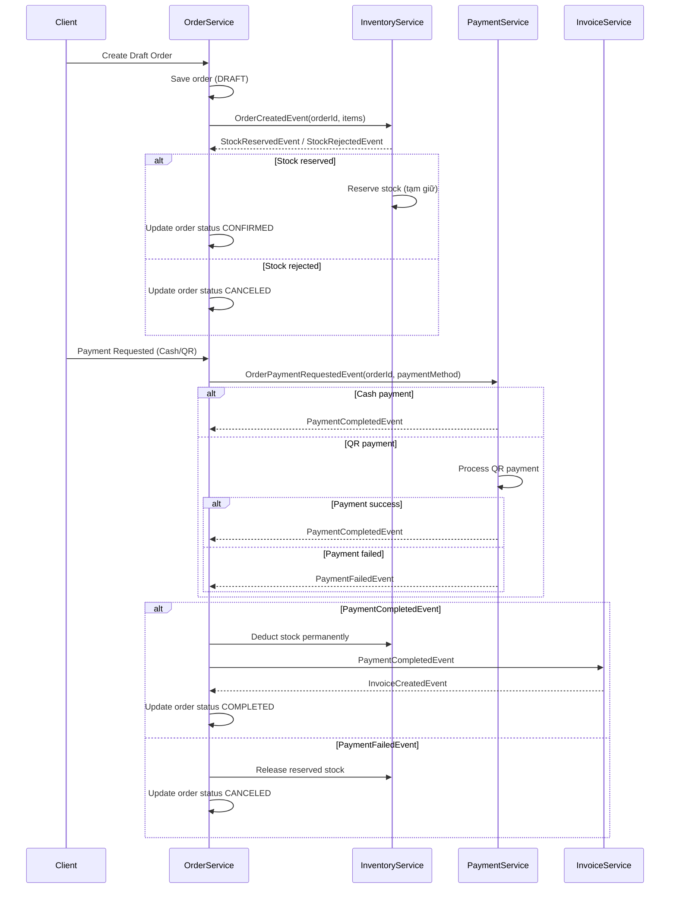
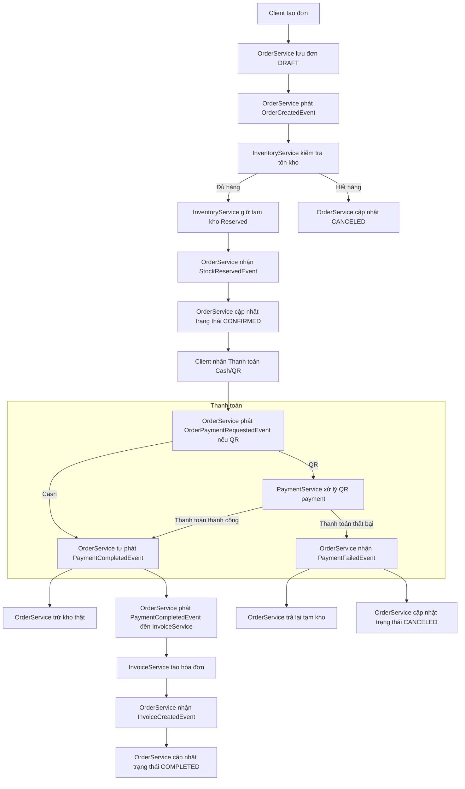

# 🏪 **ORDER SERVICE - THỰC THỂ VÀ CHỨC NĂNG**

## 🗃️ **CÁC THỰC THỂ CHÍNH TRONG ORDER SERVICE**

### **1. 🧾 ORDER (Đơn hàng)**
- **orderId**: Mã đơn hàng duy nhất
- **cashierId**: ID nhân viên bán hàng
- **storeId**: ID cửa hàng
- **customerPhone**: SĐT khách hàng (optional)
- **customerName**: Tên khách hàng (từ customer service)
- **status**: Trạng thái đơn (DRAFT, PAID, COMPLETED, CANCELLED)
- **totalAmount**: Tổng tiền hàng
- **taxAmount**: Thuế VAT
- **finalAmount**: Tổng thanh toán
- **paymentMethod**: Phương thức thanh toán (CASH, VNPAY, CARD)
- **paymentId**: ID giao dịch thanh toán
- **createdAt**: Thời gian tạo
- **completedAt**: Thời gian hoàn thành

### **2. 📦 ORDER_ITEM (Chi tiết đơn hàng)**
- **productId**: ID sản phẩm
- **barcode**: Mã vạch sản phẩm
- **productName**: Tên sản phẩm
- **unitPrice**: Đơn giá
- **quantity**: Số lượng
- **totalPrice**: Thành tiền (unitPrice * quantity)

### **3. 🧾 RECEIPT (Hoá đơn)**
- **receiptId**: Mã hoá đơn
- **receiptNumber**: Số hoá đơn (theo quy định)
- **orderId**: Liên kết đến order
- **content**: Nội dung hoá đơn (HTML/PDF)
- **issuedAt**: Thời gian xuất hoá đơn
- **taxCode**: Mã số thuế cửa hàng
- **storeInfo**: Thông tin cửa hàng

### **4. 🔄 ORDER_SAGA (Quản lý Saga)**
- **sagaId**: ID saga
- **currentStep**: Bước hiện tại
- **status**: Trạng thái saga
- **errorMessage**: Thông báo lỗi (nếu có)

## 🎯 **CHỨC NĂNG CHÍNH CỦA ORDER SERVICE**

### **1. 📋 QUẢN LÝ ĐƠN HÀNG**
- **Tạo đơn hàng** mới từ danh sách sản phẩm
- **Thêm/Xoá sản phẩm** vào đơn hàng
- **Cập nhật số lượng** sản phẩm
- **Huỷ đơn hàng** khi cần
- **Tìm kiếm & Lọc** đơn hàng theo nhiều tiêu chí

### **2. 💳 XỬ LÝ THANH TOÁN**
- **Chọn phương thức** thanh toán (Tiền mặt, VNPay, Thẻ)
- **Tính toán tiền thừa** cho thanh toán tiền mặt
- **Tạo link thanh toán** VNPay
- **Xác nhận thanh toán** thành công
- **Xử lý hoàn tiền** khi huỷ đơn

### **3. 🧾 TẠO & QUẢN LÝ HOÁ ĐƠN**
- **Tự động tạo hoá đơn** khi đơn hoàn thành
- **Định dạng hoá đơn** theo chuẩn Bộ Tài Chính
- **Lưu trữ hoá đơn** điện tử
- **Tái xuất hoá đơn** khi cần
- **In hoá đơn** trực tiếp từ POS

### **4. 🔍 QUÉT & TÌM SẢN PHẨM**
- **Quét mã vạch** để thêm sản phẩm
- **Tìm kiếm sản phẩm** theo tên/mã
- **Kiểm tra tồn kho** trước khi thêm vào đơn
- **Hiển thị thông tin** giá, tồn kho

### **5. 📊 BÁO CÁO & THỐNG KÊ**
- **Doanh thu theo ngày/tuần/tháng**
- **Top sản phẩm bán chạy**
- **Thống kê theo nhân viên**
- **Báo cáo thuế** tự động

## 🔄 **LUỒNG TẠO HOÁ ĐƠN TỰ ĐỘNG**

### **1. KÍCH HOẠT TẠO HOÁ ĐƠN**
```
Order chuyển trạng thái → COMPLETED
    ↓
Tự động trigger tạo Receipt
```

### **2. NỘI DUNG HOÁ ĐƠN BAO GỒM:**
- **Thông tin cửa hàng**: Tên, địa chỉ, MST
- **Thông tin hoá đơn**: Số, ngày, ký hiệu
- **Thông tin khách hàng** (nếu có)
- **Chi tiết sản phẩm**: Tên, ĐVT, SL, Đơn giá, Thành tiền
- **Tổng tiền hàng, Thuế VAT, Tổng thanh toán**
- **Chữ ký số** và mã xác thực

### **3. LƯU TRỮ HOÁ ĐƠN**
- **Database**: Lưu content hoá đơn (HTML/PDF)
- **File System**: Lưu file PDF backup
- **External Storage**: Upload lên cloud (tuỳ chọn)

## 🔗 **TƯƠNG TÁC VỚI CÁC SERVICE KHÁC**

### **1. 📦 INVENTORY SERVICE**
- **Kiểm tra tồn kho** trước khi thêm sản phẩm
- **Cập nhật tồn kho** khi đơn hoàn thành
- **Lấy thông tin sản phẩm** (tên, giá, mã vạch)

### **2. 👥 CUSTOMER SERVICE**
- **Tìm kiếm khách hàng** theo SĐT
- **Cập nhật điểm tích luỹ** khi đơn hoàn thành
- **Lấy thông tin khách hàng** cho hoá đơn

### **3. 💳 PAYMENT SERVICE**
- **Xử lý thanh toán** tiền mặt/VNPay
- **Xác nhận giao dịch** thành công
- **Xử lý hoàn tiền** khi huỷ đơn

### **4. 🔔 NOTIFICATION SERVICE**
- **Gửi hoá đơn điện tử** qua email/SMS
- **Thông báo trạng thái** đơn hàng

## 🎯 **CÁC TRẠNG THÁI ĐƠN HÀNG**

### **📊 ORDER STATUS FLOW:**
```
DRAFT → PAID → COMPLETED
    ↓
CANCELLED
```

- **DRAFT**: Đơn đang được tạo, chưa thanh toán
- **PAID**: Đã thanh toán, chờ xử lý kho
- **COMPLETED**: Đã xử lý xong, có hoá đơn
- **CANCELLED**: Đã huỷ, có thể hoàn tiền

## 💡 **TÍNH NĂNG NÂNG CAO**

### **1. 🧾 HOÁ ĐƠN ĐIỆN TỬ**
- **Mẫu hoá đơn** tuỳ chỉnh theo cửa hàng
- **Ký số hoá đơn** tự động
- **Gửi email/SMS** hoá đơn cho khách
- **Lưu trữ đám mây** để tra cứu

### **2. 🔄 OFFLINE SUPPORT**
- **Lưu đơn tạm** khi mất kết nối
- **Đồng bộ sau** khi có kết nối
- **Xử lý xung đột** khi đồng bộ

### **3. 📱 MULTI-DEVICE**
- **Đồng bộ real-time** giữa các thiết bị
- **Chia sẻ session** giữa các nhân viên

**Order Service đóng vai trò TRUNG TÂM trong hệ thống POS, kết nối tất cả các service và quản lý toàn bộ vòng đời đơn hàng từ lúc tạo đến khi xuất hoá đơn!** 🎉





